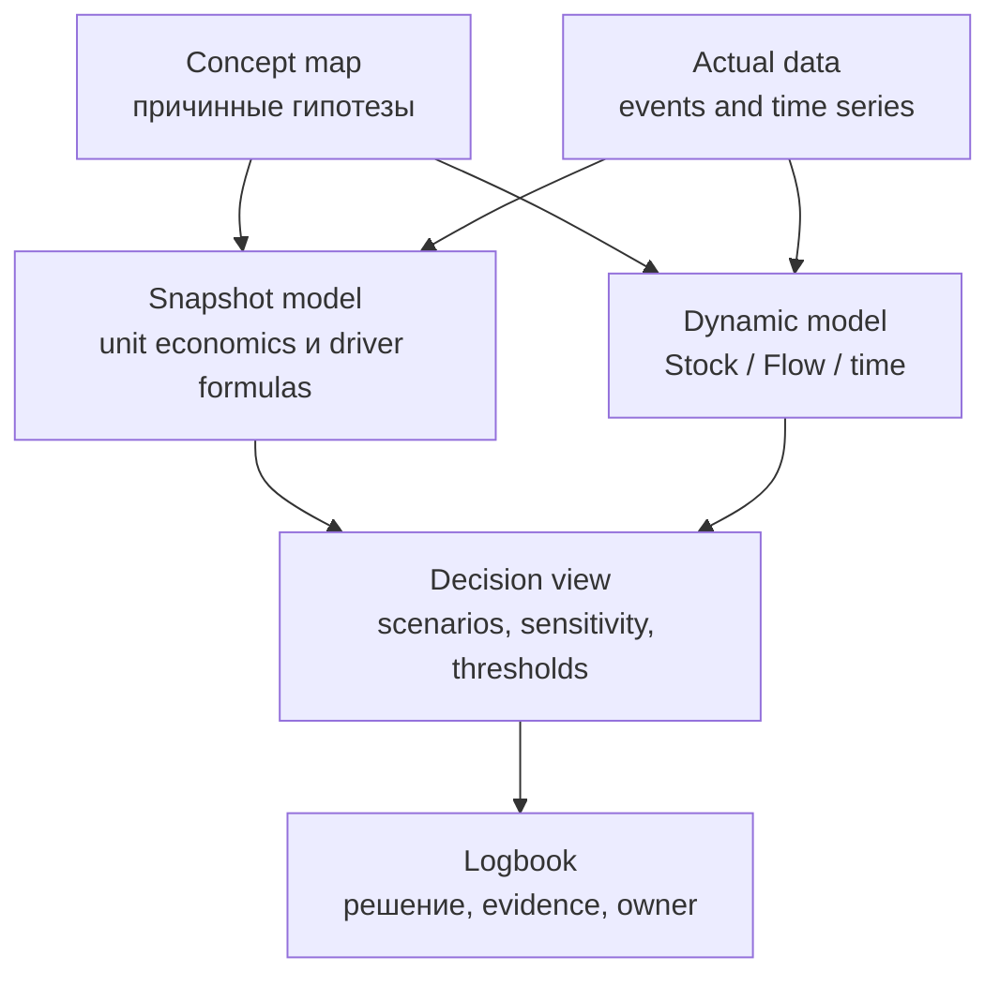
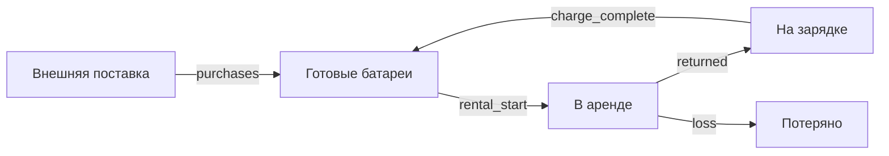

# Системная динамика, рынок и целевая архитектура EconomicSimulator

- Статус: исследование и проектные рекомендации, без реализации.
- Дата проверки источников и кода: 19 июля 2026 года.
- Репозиторий при аудите: `agent/phase-2-universal-builder`, commit `bc7a3f3`.

## Как читать этот документ

Документ отвечает на четыре вопроса:

1. как математически связаны Stock, Flow, время и обратные связи;
2. какие школы моделирования и классы инструментов существуют;
3. чему EconomicSimulator может научиться у рыночных продуктов;
4. как добавить динамическую симуляцию, не разрушив уже работающую
   snapshot-модель unit economics.

Факты о продуктах основаны на официальной документации и зафиксированы на дату
выше. Цены, редакции и условия лицензирования могут измениться. Вывод о
продуктовой нише является аналитической гипотезой, а не доказательством спроса.

## 1. Краткий вывод

### 1.1 Что такое системная динамика

Системная динамика — это не просто граф со стрелками. Исполнимая модель должна
содержать:

- состояния, которые сохраняются во времени — `Stock`;
- скорости, которые изменяют состояния — `Flow`;
- параметры и промежуточные вычисления — `Parameter` и `Auxiliary`;
- начальные условия;
- правила времени: начало, конец, единица, шаг интегрирования и частота
  сохранения результатов;
- численный метод;
- проверки размерности, ограничений и воспроизводимости.

Основное уравнение:

\[
\frac{dS}{dt} = \sum inflow - \sum outflow
\]

При простом дискретном расчёте методом Euler:

\[
S_{n+1} = S_n + \Delta t \cdot
\left(\sum inflow_n - \sum outflow_n\right)
\]

### 1.2 Как Flow связывает два Stock

Переход между двумя Stock — это один объект Flow, а не две независимые стрелки.
Один и тот же объём одновременно вычитается из источника и прибавляется в
приёмник.


Если `conversion = 100 клиентов/день`, то за четверть дня при постоянной
скорости переместится `100 × 0,25 = 25 клиентов`. Первый Stock уменьшится на 25,
второй увеличится на 25. Это даёт закон сохранения:

\[
\Delta(A+B) = 0
\]

для внутреннего перехода. Общая сумма меняется только через поток из-за границы
модели или наружу.

### 1.3 Главная рекомендация для EconomicSimulator

Не превращать текущую модель в system dynamics неявно. Ввести два явных режима:

- `snapshot` — существующий расчёт unit economics одним проходом;
- `dynamic` — новый Stock/Flow runtime с временными траекториями.

Причина: нынешние `stock`, `flow`, `rate`, `one_off` — классификация скалярных
метрик, а не исполнимые SD-сущности. Например, месячный расход сейчас может быть
`flow` с единицей RUB и grain `month`. В классической системной динамике Flow
денег должен иметь единицу RUB/время и интегрироваться в денежный Stock.

### 1.4 Рыночная гипотеза

Рынок разделён:

- Vensim, Stella и Insight Maker умеют строгую системную динамику;
- AnyLogic соединяет SD, discrete event и agent-based simulation;
- Kumu и Loopy хорошо объясняют причинную карту;
- Mixpanel и Amplitude связывают metric trees с фактическими продуктовыми
  данными;
- Pigment, Lucanet xP&A/Causal, Runway и Modeliks дают driver-based финансовые
  сценарии.

Потенциальная ниша EconomicSimulator находится между ними: понятный
product-manager-first инструмент, который соединяет дерево продуктовых
драйверов, строгие Stock/Flow, unit economics, фактические данные, сценарии и
объяснение пути влияния до North Star.

Это направление сильнее, чем попытка создать ещё один универсальный AnyLogic.

## 2. Математический фундамент

### 2.1 Пять базовых сущностей

| Сущность | Простой вопрос | Математический смысл | Пример |
|---|---|---|---|
| Stock | Сколько есть сейчас? | Состояние \(S(t)\) | активные клиенты, деньги, батареи |
| Flow | С какой скоростью Stock меняется? | Производная или transition rate | клиенты/день, RUB/месяц |
| Auxiliary | Что вычисляется мгновенно? | \(A(t)=g(S,P,t)\) | загрузка, средний чек, желаемый спрос |
| Parameter | Какое допущение фиксировано в run? | \(P\) или \(P(t)\) | churn rate, цена, capacity |
| Event | Что произошло в конкретный момент? | Дискретное событие | платёж, возврат, найм |

Stock имеет память. Если все входящие и исходящие потоки остановить, Stock
сохранит последнее значение. Flow, Auxiliary и Parameter сами по себе памятью не
обладают, если для них явно не определена задержка или история.

Практический тест: если «заморозить время», запасы денег, клиентов или батарей
останутся; продажи в день, найм в месяц и возвраты в час остановятся.

### 2.2 Непрерывная и периодическая модель — не одно и то же

#### Непрерывная интерпретация

Потоки являются скоростями:

\[
\frac{dCustomers}{dt} = acquisitionRate - churnRate
\]

Единицы:

- `Customers`: customer;
- `acquisitionRate`: customer/month;
- `churnRate`: customer/month;
- `dt`: month.

Тогда `flow × dt` имеет ту же единицу, что и Stock.

#### Дискретная периодическая интерпретация

Если продуктовая модель утверждает, что за месяц было приобретено 100 клиентов
и ушло 80, можно задать recurrence:

\[
Customers_{m+1} = Customers_m + Acquired_m - Churned_m
\]

Здесь `Acquired_m` и `Churned_m` уже являются итогами за период. Их нельзя ещё
раз умножать на длительность месяца.

#### Почему это критично

Одинаковая подпись «Flow» может означать:

- скорость `100 клиентов/месяц`;
- итог `100 клиентов за июль`;
- последовательность пользовательских событий в product analytics.

Это три разных объекта. EconomicSimulator должен показывать семантику, а не
только число и красивую подпись.

### 2.3 Состояние системы в векторной форме

Для нескольких Stock удобно записывать:

\[
\dot{\mathbf{x}} = f(t,\mathbf{x},\mathbf{u},\mathbf{p})
\]

где:

- \(\mathbf{x}\) — все Stock;
- \(\mathbf{u}\) — внешние воздействия и временные ряды;
- \(\mathbf{p}\) — параметры сценария;
- \(f\) — правила всех потоков.

Наблюдаемые результаты:

\[
\mathbf{y}=g(t,\mathbf{x},\mathbf{u},\mathbf{p})
\]

Например, Stock клиентов и денег образуют состояние, а MRR, CAC, LTV, загрузка
поддержки и North Star могут быть вычисляемыми выходами.

### 2.4 Три типа стрелок

В одном интерфейсе необходимо различать:

| Тип | Что означает | Может менять Stock напрямую? |
|---|---|---:|
| Material Flow | Реальное перемещение или накопление | Да, через интегрирование |
| Equation Dependency | Значение используется в формуле Flow/Auxiliary | Нет |
| Influence Hypothesis | Причинная гипотеза с sign/confidence/evidence | Нет, пока не формализована уравнением |

Правило Stella хорошо иллюстрирует строгую семантику: информационный connector
может идти от Stock к Flow или converter, но не должен записывать значение
непосредственно в Stock. Stock меняется только через Flow.

Для EconomicSimulator это означает:

- текущий `calc` — будущий `equation_dependency`;
- текущий `influence` — `influence_hypothesis`;
- для динамики нужен новый `material_flow`, визуально похожий на трубу с
  клапаном, а не на обычную стрелку.

### 2.5 Feedback loop и algebraic loop

#### Разрешённая обратная связь через Stock

\[
Customers \rightarrow WordOfMouth \rightarrow Acquisition
\rightarrow Customers
\]

Цикл разрешён, потому что Stock хранит предыдущее состояние. В момент \(t_n\)
текущие клиенты определяют acquisition rate, после чего интегратор вычисляет
Stock на \(t_{n+1}\).

#### Мгновенный algebraic loop

\[
A=B+1,\qquad B=A/2
\]

Обе переменные требуют значение другой в тот же момент. Это не динамическая
обратная связь, а система одновременных алгебраических уравнений. Для её решения
нужен отдельный iterative/Newton solver.

Рекомендация для первого runtime:

- feedback через хотя бы один Stock — разрешать;
- strongly connected component только из Flow/Auxiliary — отклонять как
  `algebraic_loop`;
- не добавлять implicit solver в MVP.

### 2.6 Усиливающие и балансирующие петли

В causal loop diagram связь имеет знак:

- `+` — при прочих равных изменение причины меняет следствие в том же
  направлении;
- `−` — в противоположном направлении.

Петля:

- reinforcing (`R`), если произведение знаков положительно;
- balancing (`B`), если произведение знаков отрицательно.

Но знак не говорит о силе, временной задержке и количественном эффекте. В
нелинейной модели доминирующая петля может меняться во времени. Поэтому
автоматически найденный цикл полезен как навигация, но не как доказательство
причины поведения.

### 2.7 Задержки

Задержка — не просто сдвиг линии на графике.

| Вид | Пример | Как моделировать |
|---|---|---|
| Material delay | доставка, зарядка, onboarding | pipeline/conveyor или цепочка Stock |
| Information delay | сглаженная оценка спроса | exponential smoothing Stock |
| Fixed delay | контракт начинает действовать через 30 дней | очередь истории или delay operator |
| Decision delay | менеджер реагирует раз в месяц | event/scheduled policy |

Задержки часто создают колебания. Если модель пополнения реагирует на устаревший
остаток, система может постоянно заказывать слишком много, затем слишком мало.

### 2.8 Нелинейности и ограничения

Типичные функции:

- `min(demand, capacity)`;
- saturation;
- lookup/table function;
- threshold;
- piecewise tariff;
- sigmoid/logistic response;
- non-negative constraint.

Нельзя просто вычислить отрицательный Stock, а затем молча заменить его на ноль.
Такое обрезание уничтожает conservation. Нужно ограничивать допустимые outflow,
фиксировать, какой constraint сработал, и показывать неудовлетворённый спрос.

## 3. Время и гранулярность

### 3.1 Пять разных настроек

Слово «гранулярность» скрывает пять независимых понятий:

| Понятие | Вопрос | Пример |
|---|---|---|
| Model time unit | В чём измеряется время? | day |
| Integration step `dt` | Как часто обновляется состояние? | 0,25 day |
| Save interval | Как часто сохраняется результат? | 1 day |
| Display aggregation | Как группируется график? | month |
| Entity/data grain | Для какой сущности существует значение? | station × day |

Пример корректной конфигурации:

```text
model time unit = day
dt = 0.25 day
saveEvery = 1 day
display = calendar month
entity grain = station
```

Модель делает четыре внутренних шага в день, сохраняет одно дневное значение и
показывает пользователю месячные итоги.

### 3.2 `dt` не равен частоте графика

Vensim отделяет `TIME STEP` от `SAVEPER`, XMILE — `dt` от output
спецификации. Это даёт:

- достаточную численную точность;
- компактный результат;
- график в удобном бизнес-периоде.

Если сохранять каждую внутреннюю четверть дня на пять лет для сотен переменных и
сотен сценариев, объём данных быстро станет больше самой модели.

### 3.3 Как выбирать шаг

Практическое правило:

1. найти самую короткую значимую задержку или time constant;
2. выбрать `dt` заметно меньше неё;
3. прогнать модель;
4. повторить с `dt / 2`;
5. сравнить ключевые траектории и решение;
6. уменьшать шаг, пока вывод не стабилизируется.

Stella прямо рекомендует half-step test. Vensim рекомендует, чтобы `TIME STEP`
был меньше кратчайшего значимого периода изменения и не превышал `SAVEPER`.

Меньший `dt` не исправляет неверную структуру и плохие параметры. Почасовой
расчёт churn, оценённого только по месячным данным, создаёт ложную точность.

### 3.4 Euler

\[
S_{n+1}=S_n+\Delta t\cdot f(t_n,S_n)
\]

Плюсы:

- прозрачен;
- легко объяснить и проверить;
- соответствует многим явным period-by-period бизнес-моделям;
- стандарт XMILE использует Euler как default.

Минусы:

- ошибка первого порядка;
- при крупном `dt` может создавать ложные колебания, отрицательные значения или
  неустойчивость.

### 3.5 Heun / RK2

Сначала делается прогноз:

\[
\tilde S=S_n+\Delta t\cdot f(t_n,S_n)
\]

Затем среднее двух наклонов:

\[
S_{n+1}=S_n+\frac{\Delta t}{2}
\left[f(t_n,S_n)+f(t_{n+1},\tilde S)\right]
\]

Heun остаётся понятным, но обычно значительно точнее Euler на гладких моделях.

### 3.6 RK4 и adaptive solvers

RK4 оценивает четыре наклона внутри шага. Он точнее для гладких непрерывных
моделей, особенно колебательных, но:

- сложнее объяснять;
- четыре раза вычисляет правую часть на шаг;
- не устраняет discontinuities;
- не заменяет проверку `dt`.

Adaptive solvers автоматически меняют внутренний шаг по tolerance. SciPy
`solve_ivp`, например, предлагает explicit RK для non-stiff и Radau/BDF для
stiff систем. Но ODE solver сам по себе не даёт Stock/Flow-семантику, units,
scenario management и model validation.

Рекомендованный порядок для EconomicSimulator:

1. fixed-step Euler;
2. обязательный `dt / 2` test;
3. Heun или fixed RK4;
4. adaptive solver только при доказанной потребности.

### 3.7 Численный пример

Модель активных клиентов:

\[
\frac{dC}{dt}=100-0.08C,\qquad C(0)=1000
\]

Через 12 месяцев аналитическое решение равно примерно `1154,277`.

| Метод | `dt`, месяца | Результат | Ошибка |
|---|---:|---:|---:|
| Euler | 1 | 1158,083 | +3,807 |
| Euler | 0,5 | 1156,147 | +1,870 |
| Euler | 0,25 | 1155,204 | +0,927 |
| Heun | 1 | 1154,173 | −0,104 |
| Heun | 0,5 | 1154,252 | −0,025 |
| Heun | 0,25 | 1154,271 | −0,006 |

Таблица показывает две вещи:

- уменьшение `dt` приводит результат Euler к правильному значению;
- более сложный метод может дать меньшую численную ошибку, но это не делает
  бизнес-допущения более истинными.

### 3.8 Календарный месяц

`day` и `month` относятся к одной физической размерности времени, но календарный
месяц не равен фиксированному количеству дней. Нужны две политики:

- `fixed_duration`: например, модельный месяц = 30 дней;
- `calendar`: реальные даты и месяцы разной длины.

Переход `day → month` нельзя выполнять молча. Конфигурация и результаты должны
показывать выбранную политику.

## 4. Сценарии, неопределённость и проверка модели

### 4.1 Scenario, sensitivity и forecast

Это разные вещи:

| Термин | Что меняется | На какой вопрос отвечает |
|---|---|---|
| Scenario | Несколько связанных допущений | Что будет в согласованном варианте мира? |
| Sensitivity | Один или много параметров в диапазоне | От чего вывод наиболее хрупок? |
| Forecast | Оценка будущих наблюдений | Что, вероятно, произойдёт? |
| Optimization | Управляемые параметры | Какой вариант максимизирует objective? |

Simulation не является обещанием будущего. Она показывает последствия
структуры и допущений.

### 4.2 Локальная чувствительность

Нормированная эластичность:

\[
E_{Y,p}=
\frac{\Delta Y/Y}{\Delta p/p}
\]

Она подходит для ranking драйверов и tornado chart, но может зависеть от точки
baseline и размера шока.

### 4.3 Global sensitivity и Monte Carlo

Параметры задаются распределениями или диапазонами, модель запускается много
раз. Результат должен показывать:

- медиану;
- percentile bands;
- вероятность нарушения guardrail;
- число runs;
- sampling method;
- random seed.

Без seed и полной run specification результат невоспроизводим.

### 4.4 Калибровка

Параметры можно подбирать так, чтобы trajectory была близка к историческим
данным:

\[
J(\theta)=\sum_t w_t
\left(y_{\text{model}}(t,\theta)-y_{\text{actual}}(t)\right)^2
\]

Но хорошее совпадение не доказывает правильную причинную структуру. Несколько
разных моделей могут одинаково описывать прошлое и расходиться после
интервенции.

### 4.5 Минимальный набор validation tests

Сильная практика системной динамики включает:

- structure assessment;
- dimensional consistency;
- boundary adequacy;
- extreme-condition tests;
- behavior reproduction;
- parameter sensitivity;
- policy robustness;
- surprise behavior analysis;
- сравнение `dt` и `dt / 2`;
- проверку инвариантов.

Примеры Reality Check:

- при нулевом количестве готовых батарей выдача не может быть положительной;
- один внутренний transfer не меняет общее число объектов;
- без найма headcount не растёт;
- без клиентов продуктовая выручка не положительна;
- cash не меняется при нулевых денежных flows.

## 5. Школы и методы

Ни одна школа не заменяет остальные. Они отвечают на разные вопросы.

| Подход | Центральная идея | Математический аппарат | Когда полезен |
|---|---|---|---|
| General Systems Theory | Целое, границы, взаимозависимость | Общие системные понятия | Сформулировать объект и границы |
| Cybernetics / Control Theory | Регулирование, информация, feedback, stability | State space, transfer functions, control laws | Управляемые технические и организационные контуры |
| System Dynamics | Aggregate stocks, flows, delays, endogenous feedback | ODE/difference equations, simulation | Стратегические изменения во времени |
| Soft Systems Methodology | Проблема зависит от взглядов участников | Rich pictures, root definitions, conceptual activity models | Неопределённые организационные ситуации |
| Complexity Science | Emergence, networks, adaptation, nonlinearity | Network models, stochastic processes, nonlinear dynamics | Системы с возникающим коллективным поведением |
| Agent-Based Modeling | Поведение возникает из взаимодействий неоднородных агентов | Discrete stochastic simulation | Сегменты, сети, индивидуальная история |
| Discrete-Event Simulation | Система меняется при событиях | Event calendar, queues, resources, distributions | Операции, очереди, расписания, capacity |
| Causal Inference / SCM | Эффект интервенции при явных assumptions | DAG, structural equations, do-calculus | Оценить причинный эффект по данным/экспериментам |
| Operations Research | Найти лучшее решение при ограничениях | Optimization, LP/MIP, dynamic programming | Выбрать политику после определения модели |

### 5.1 Историческая линия

- Ludwig von Bertalanffy развивал общую теорию систем.
- Norbert Wiener сформулировал cybernetics как исследование управления и
  коммуникации в животных и машинах.
- Jay Forrester в MIT перенёс feedback-подход в управление и в конце 1950-х
  создал system dynamics; `Industrial Dynamics` вышла в 1961 году.
- Peter Checkland разработал Soft Systems Methodology для ситуаций, где
  участники по-разному видят саму проблему.
- Complexity science и agent-based modeling сделали акцент на неоднородности,
  локальных правилах и emergence.

### 5.2 Современные направления

Наиболее заметные практические движения:

1. **Participatory and group model building.** Стейкхолдеры участвуют в
   формулировке проблемы, reference modes, causal map и проверке модели.
2. **Hybrid simulation.** SD соединяется с DES и ABM, когда aggregate-модель
   недостаточна.
3. **Open interchange and headless engines.** XMILE, PySD и BPTK-Py отделяют
   модель от одного desktop-продукта.
4. **Calibration and uncertainty quantification.** Вместо одного «точного»
   сценария используются ranges, ensembles и policy robustness.
5. **Connection with causal inference.** Эксперименты и observational data
   уточняют параметры, но CLD не подменяет идентификацию causal effect.
6. **Explainable decision interfaces.** Пользователю показывают не только
   график, но формулу, causes, assumptions, evidence и ограничения.
7. **AI-assisted model building.** Stella и Mixpanel уже используют AI для
   черновиков моделей и metric trees. AI полезен как помощник, но структура,
   размерность и причинные предположения требуют проверки человеком.

## 6. Рынок инструментов

### 6.1 Карта рынка

| Класс | Основная задача | Примеры |
|---|---|---|
| Professional SD | Строгие исполнимые модели | Vensim, Stella, Powersim |
| Web-first SD | Быстро создать и поделиться | Insight Maker, Stella Online |
| Multimethod | SD + DES + ABM | AnyLogic |
| Discrete event | Очереди, ресурсы, throughput | Simul8 |
| Systems mapping | Понять причинную структуру | Kumu, Loopy |
| Agent based | Неоднородные участники и сети | NetLogo, AnyLogic, BPTK-Py |
| Headless/open engines | Выполнение, API, analytics | PySD, BPTK-Py, Simantics |
| Product analytics | Actual funnels, retention, cohorts | Mixpanel, Amplitude |
| FP&A / planning | Driver-based финансовые сценарии | Pigment, Lucanet xP&A/Causal, Runway, Modeliks |

### 6.2 Сравнительная матрица основных решений

Обозначения: `++` — сильный основной сценарий; `+` — поддерживается; `±` —
ограниченно или не основной фокус; `—` — отсутствует в основном продукте.

| Продукт | Stock/Flow | CLD | ABM/DES | Units | Solver и `dt` | Sensitivity / optimization | Data / sharing | Доступ на 19.07.2026 |
|---|---:|---:|---:|---:|---:|---:|---:|---|
| Vensim | ++ | ++ | ± | ++ | ++ | ++ | ++ / file-DSS | PLE free academic; Pro/DSS commercial |
| Stella | ++ | ++ | + | ++ | ++ | ++ | ++ web/interfaces | Online limited; Pro $2,999; Architect $3,999 |
| AnyLogic | ++ | + | ++ | + | ++ | ++ | ++ cloud/API | PLE free learning; commercial quote |
| Insight Maker | ++ | ++ | + ABM | ++ | + Euler/RK4 | + | ++ browser/share | Free |
| Powersim Studio | ++ | + | ± | ++ | + | ++ | + | Express free; paid editions |
| Simantics SD | ++ | ++ | — | ++ | ++ | + | + | Free, EPL |
| PySD | runtime | — | — | model-dependent | + | via Python | ++ Pandas/API | Open source |
| BPTK-Py | ++ runtime | via import | + ABM | model-dependent | + | scenarios | ++ Pandas/REST | MIT |
| Kumu | visual only | ++ | — | — | — | graph metrics | ++ collaboration | Free public; paid private |
| Loopy | illustrative | simplified | — | — | illustrative | — | + share/remix | Free/public domain |
| Simul8 | ± | — | ++ DES | domain-specific | event time | ++ | ++ | Quote |
| NetLogo | ± extension | — | ++ ABM | — | ticks | ++ batch | + | Free/GPL |

Цены приведены только как ориентир на дату исследования. Для решения о покупке
нужно повторно проверить storefront и условия конкретной лицензии.

### 6.3 Что изучать в каждом продукте

#### Vensim — эталон строгости

Сильные паттерны:

- отдельные `INITIAL TIME`, `FINAL TIME`, `TIME STEP`, `SAVEPER`;
- Euler, difference mode, fixed и adaptive Runge–Kutta;
- units check;
- SyntheSim с живыми параметрами;
- Causal Tracing и causes/uses;
- Monte Carlo, calibration, optimization;
- Reality Check;
- сравнение runs и работа с внешними datasets.

Что взять:

- полный run contract;
- live-preview параметров;
- trace результата до причин;
- executable invariants;
- разделение модели, run settings, данных и результата.

Что не копировать:

- desktop-first профессиональную сложность;
- зависимость базовой полезности от дорогих редакций.

#### Stella — эталон обучения и decision interface

Сильные паттерны:

- строгие stocks, flows, converters и connectors;
- Map → Model → Explore → Interface;
- Stella Live;
- Causal Lens;
- Loops That Matter — вклад loops меняется по времени;
- story и interactive simulation app;
- units, sensitivity, optimization, XMILE;
- half-step test для `dt`.

Что взять:

- progressive disclosure;
- отдельный Explore mode без изменения модели;
- story/presentation layer;
- объяснение поведения, а не только структуры.

#### AnyLogic — эталон границ методов

AnyLogic объединяет:

- continuous system dynamics;
- discrete-event process simulation;
- agent-based modeling;
- гибридные переходы между ними.

Что взять:

- явный выбор engine type;
- reproducible experiment configuration;
- модульность и возможность будущего hybrid runtime.

Что не делать сейчас:

- отраслевые библиотеки, 3D, GIS, Java extension и cloud experiments;
- объединение SD, DES и ABM в первом релизе.

#### Insight Maker — эталон web-first onboarding

Сильные паттерны:

- causal map и executable simulation в браузере;
- start, length, time step, time unit;
- Euler/RK4;
- units и model verification;
- time-series, tables, export;
- link/embed и open simulation package.

Что взять:

- короткий путь `создать → запустить → поделиться`;
- простой UI без отказа от units;
- API/headless boundary.

#### Kumu и Loopy — эталон causal storytelling

Kumu:

- loop как объект с названием и narrative;
- evidence на node/connection/loop;
- views и filters поверх одной карты;
- automatic loop detection;
- presentation и collaboration.

Loopy:

- почти нулевой порог входа;
- нарисовать узлы и same/opposite arrows;
- дать импульс и увидеть распространение.

Что взять:

- отдельный `Concept mode`;
- evidence и confidence;
- quick play для обучения;
- предложение формализовать conceptual map в Stock/Flow.

Нельзя считать их численным SD-engine: там нет строгой conservation,
dimensional model и промышленного solver contract.

#### PySD, BPTK-Py и Simantics — эталон отделения runtime

Полезные идеи:

- editor и engine — разные слои;
- модель можно импортировать через XMILE;
- scenario configuration сериализуется;
- результаты возвращаются как обычная таблица;
- один и тот же model contract можно проверять несколькими engines;
- regression library содержит эталонные модели.

Рекомендация: не добавлять Python как обязательную локальную зависимость.
Использовать PySD как reference oracle для тестирования XMILE subset.

### 6.4 Product analytics — смежный слой

#### Mixpanel Metric Trees

По официальной документации Metric Trees связывают:

- North Star;
- input/output metrics;
- bets и эксперименты;
- реальные отчёты;
- owners;
- annotations/logbook;
- time comparisons;
- collaborative canvas.

Это сильный ориентир для живого дерева метрик. Но заявления о причинном влиянии
остаются частью модели команды, а не автоматически доказанным causal effect.

#### Amplitude North Star Framework

Amplitude описывает North Star и input metrics как scaffold из assumptions,
beliefs и causal relationships. Это полезный вход в моделирование, но не
Stock/Flow runtime.

#### Что взять EconomicSimulator

- связать каждую метрику с actual report;
- хранить owner и definition;
- прикреплять experiment evidence к influence;
- показывать одинаковый time comparison на связанных карточках;
- вести logbook изменений assumptions и решений;
- не смешивать observed correlation и causal hypothesis.

### 6.5 FP&A и unit economics — смежный слой

#### Pigment

Полезное различие:

- Scenario — быстрый ad-hoc what-if;
- Version — повторяемый, аудируемый planning cycle.

Сильные паттерны:

- multidimensional model;
- scenario comparison;
- actual/budget/forecast;
- governed definitions и permissions.

#### Lucanet xP&A / Causal

Causal был приобретён Lucanet в 2024 году и развивается в xP&A-направлении.
Полезные паттерны:

- base model + тонкий слой scenario overrides;
- driver-based operational/financial graph;
- dimensions;
- daily/weekly/monthly forecast;
- plan versus actual;
- traceable formulas.

#### Runway и Modeliks

Полезные паттерны:

- понятный PM/CFO-oriented scenario builder;
- headcount, revenue, cash и runway templates;
- guided wizard вместо обязательного пустого Canvas;
- автоматические финансовые результаты из операционных drivers;
- мгновенное сравнение сценариев.

#### Чего не хватает FP&A

Обычно пользователь не видит:

- explicit material flows;
- conservation;
- feedback loop dominance;
- integration method;
- `dt` convergence;
- физические ограничения Stock.

### 6.6 Вывод о рыночной нише

На основании изученных возможностей виден разрыв:

```text
Product analytics
    сильна в actual events, funnels, cohorts
             ↓
EconomicSimulator opportunity
    product semantics + causal map + stock-flow
    + unit economics + scenarios + explanation
             ↑
System dynamics / FP&A
    сильны в simulation или planning,
    но редко соединяют оба слоя для PM
```

Это продуктовая гипотеза. Для её проверки нужны интервью и наблюдение за
реальными задачами PM, а не только анализ функций конкурентов.

## 7. Что уже есть в EconomicSimulator

### 7.1 Сильный фундамент

По текущему коду:

- [`src/core/model.ts`](../src/core/model.ts) содержит сериализуемую схему,
  `UnitSpec`, `Grain`, AST формул, scenarios и provenance;
- [`src/core/evaluator.ts`](../src/core/evaluator.ts) строит Calculation DAG,
  проверяет формулы и выполняет расчёт;
- [`src/core/units.ts`](../src/core/units.ts) реализует вектор размерностей,
  умножение, деление и равенство units;
- [`src/core/analysis.ts`](../src/core/analysis.ts) содержит static Impact и
  threshold analysis;
- [`src/core/storage.ts`](../src/core/storage.ts) и
  [`src/app/model-library.ts`](../src/app/model-library.ts) дают schema,
  localStorage, backup, import/export и библиотеку моделей;
- Calculation и Influence уже разделены визуально и семантически.

Это хорошая основа. Headless core не зависит от React, поэтому новый runtime
можно тестировать отдельно от Canvas.

### 7.2 Чего сейчас нет

Текущий engine — snapshot calculator:

- `MetricDef.value` — одно `number | null`;
- Scenario — `Record<string, number>`;
- `ModelState` не содержит simulation start/stop, `dt`, solver, initial Stock,
  inflow/outflow или result timeseries;
- `evaluateModel` делает один topological pass;
- любой Calculation-cycle отклоняется;
- Impact Mode делает два статических расчёта до/после shock;
- пользовательский formula parser поддерживает базовую арифметику, но не
  `TIME`, `INITIAL`, `STEP`, `PULSE`, lookup, delay или прошлое состояние.

Следовательно, визуальный тип `stock` пока не накапливает Flow.

### 7.3 Терминологический конфликт

Текущая предметная модель определяет:

- `Stock` — состояние на момент;
- `Flow` — итог за интервал;
- `Rate` — величина на единицу времени, события или другой базы.

Классическая системная динамика обычно называет `Flow` именно скоростью
изменения Stock. Vensim прямо использует `rate` и `flow` как близкие термины.

Автоматическая миграция опасна:

- CAPEX или срок службы могут выглядеть как `stock`, но не являются
  интегрируемым состоянием;
- расход за месяц с unit `RUB` — period total, а не `RUB/month` transition rate;
- текущая `flow`-карточка может не иметь source/target Stock.

### 7.4 Рекомендованное разведение терминов

#### Snapshot mode

- `snapshot_state` — значение на дату;
- `period_total` — итог за период;
- `rate_or_ratio` — скорость, цена на единицу или ratio;
- `one_off` — разовое значение.

Пользовательские подписи могут быть:

- «Состояние на дату»;
- «Итог за период»;
- «Коэффициент / скорость»;
- «Разовое значение».

#### Dynamic mode

- `stock`;
- `transfer_flow`;
- `auxiliary`;
- `parameter`;
- `event` позже.

Это позволяет сохранить обратную совместимость и не выдавать snapshot-метрику
за исполнимую динамику.

## 8. Целевой продуктовый контракт

### 8.1 Два режима, одна рабочая среда



Не каждая conceptual relation обязана стать формулой. Не каждая snapshot-модель
нуждается в динамике.

### 8.2 Предлагаемые сущности

```ts
type DynamicVariable =
  | {
      kind: 'stock';
      initial: FormulaSpec;
      inflowIds: string[];
      outflowIds: string[];
      nonNegative?: boolean;
    }
  | {
      kind: 'flow';
      equation: FormulaSpec;
      sourceStockId?: string;
      targetStockId?: string;
    }
  | {
      kind: 'auxiliary';
      equation: FormulaSpec;
    }
  | {
      kind: 'parameter';
      value: number | TimeSeriesInput;
    };

interface SimulationSpec {
  start: number;
  stop: number;
  dt: number;
  saveEvery: number;
  timeUnit: 'day' | 'week' | 'month' | 'year';
  calendarMode: 'fixed_duration' | 'calendar';
  method: 'euler' | 'heun' | 'rk4';
}
```

Это проектная иллюстрация, не готовый API.

### 8.3 Compiler до runtime

Pipeline:

1. runtime-schema validation;
2. разрешение ID/aliases;
3. unit и time validation;
4. отдельный граф initial equations;
5. instantaneous dependency graph;
6. strongly connected components;
7. отклонение algebraic loops;
8. стабильный evaluation order;
9. compilation в execution plan;
10. model content hash.

### 8.4 Чистый runtime

```ts
simulate(compiledModel, scenario, runSpec): RunResult
```

Runtime не должен:

- читать React state;
- обращаться к localStorage;
- использовать текущие часы;
- использовать случайность без seed;
- зависеть от порядка объектов в JSON.

Все Stock на шаге обновляются одновременно. Последовательное обновление сделает
результат зависимым от порядка обхода.

### 8.5 Model, experiment и result — разные артефакты

`RunResult` должен хранить:

- `modelHash`;
- `scenarioHash`;
- `engineVersion`;
- полный `SimulationSpec`;
- timestamps;
- series/columns;
- warnings и constraints;
- solver statistics;
- seed для stochastic run;
- `createdAt` только как метаданные.

`createdAt` не входит в content hash.

Модели и маленькие сценарии можно оставить в localStorage. Time-series и
множество runs логичнее хранить в IndexedDB. Backend не нужен только ради
первого локального Euler.

### 8.6 Units и время

Для dynamic mode нужно:

- одна базовая размерность времени;
- явные scale/conversion rules;
- отдельная calendar policy;
- проверка `unit(flow) × unit(dt) = unit(stock)`;
- запрет молчаливой конверсии calendar month;
- отображение unit на каждой формуле и линии.

Текущая модель с независимыми dimension keys `time:day` и `time:month` подходит
для строгого snapshot-контракта, но требует расширения для интегрирования.

### 8.7 XMILE

XMILE 1.0 определяет переносимый контракт для:

- `sim_specs`;
- stocks, flows, auxiliaries;
- initial equations;
- inflow/outflow references;
- units;
- `dt` и integration method.

Рекомендация:

- проектировать внутренний IR с оглядкой на XMILE;
- не использовать XML как внутреннюю БД;
- реализовать документированный XMILE subset позже;
- выдавать capability report при импорте;
- не пытаться сразу поддержать arrays, macros, queues, conveyors, submodels и
  vendor extensions.

## 9. UX и визуализация

### 9.1 Режимы Canvas

| Режим | Что видит пользователь |
|---|---|
| Concept | Causal links, sign, confidence, evidence, loops |
| Structure | Stocks, material flows, auxiliaries, parameters |
| Formula | Equation dependencies и unit checks |
| Explore | Live sliders, current values, causes/uses |
| Run | Playback траектории |
| Compare | Baseline и scenarios |
| Analysis | Sensitivity, thresholds, guardrails |
| Story | Пошаговое раскрытие модели для встречи |

Не нужно показывать все типы линий одновременно. Один model graph может иметь
несколько projections/views.

### 9.2 Карточки

Stock:

- текущее значение на выбранном времени;
- sparkline;
- initial value;
- inflows/outflows;
- min/max/non-negative status.

Flow:

- rate и unit;
- transferred amount за выбранный interval;
- source/target;
- constraint status.

Parameter:

- baseline;
- scenario override;
- диапазон;
- evidence/confidence;
- owner.

### 9.3 Результаты

Минимальный набор:

- line chart для Stock;
- bar/area за период для Flow;
- baseline vs scenario;
- actual vs simulated разными стилями;
- table;
- final/min/max/cumulative/time-to-threshold;
- CSV export;
- warning при непрошедшем `dt / 2` test.

Позже:

- percentile bands;
- tornado chart;
- phase plot;
- histogram;
- loop contribution over time.

### 9.4 Объяснение результата

Пользователь должен иметь возможность спросить:

- почему North Star изменилась;
- какие Stock и Flow определили изменение;
- когда эффект стал заметен;
- когда достиг пика;
- какая петля доминировала;
- какое assumption сильнее всего влияет на вывод;
- какой constraint ограничил результат;
- из какого actual/experiment взят параметр.

## 10. Первый динамический кейс TokBeri

Не следует переносить всю экономику сразу. Лучший vertical slice — физический
контур батарей.



Уравнения:

\[
\frac{dReady}{dt}=purchases+chargeComplete-rentalStart
\]

\[
\frac{dRented}{dt}=rentalStart-returned-loss
\]

\[
\frac{dCharging}{dt}=returned-chargeComplete
\]

\[
\frac{dLost}{dt}=loss
\]

Проверки:

- `Ready`, `Rented`, `Charging`, `Lost` не отрицательны;
- каждый внутренний transfer имеет одинаковую величину на source и target;
- без purchase и списания суммарное количество сохраняется;
- rental_start ограничен доступностью;
- неудовлетворённый спрос сохраняется отдельной диагностикой;
- capacity constraint не скрывается;
- `dt` и `dt / 2` дают одинаковый управленческий вывод.

После этого можно связать физический контур со snapshot unit economics:

- successful rentals;
- revenue;
- acquiring;
- venue commission;
- wear;
- lost-device recovery;
- cash contribution.

Сначала граница между моделями может быть явным output mapping, а не единым
гигантским graph.

## 11. Другие продуктовые шаблоны

### 11.1 SaaS customer base

Stocks:

- leads;
- registered;
- activated;
- trial;
- paying;
- churned.

Flows:

- acquisition;
- activation;
- conversion;
- churn;
- reactivation.

Один transition должен уменьшать source и увеличивать target одним и тем же
числом. Два независимых процента создадут пользователей «из воздуха».

### 11.2 MRR

MRR имеет unit `currency/time` и может рассматриваться как state variable:

\[
MRR_{m+1}=MRR_m+NewMRR+Expansion-Contraction-ChurnedMRR
\]

В дискретной месячной модели additions являются итогами за месяц. В непрерывной
форме производная MRR имеет unit `currency/time²`. Интерфейс обязан явно
показывать выбранную семантику.

### 11.3 Cash

Stock:

- cash, currency.

Flows:

- payments;
- payroll;
- infrastructure;
- marketing;
- tax;
- capex payments.

Derived:

- net cash flow;
- burn;
- runway;
- minimum cash;
- time to zero.

### 11.4 Headcount и capacity

Stocks:

- candidates;
- hired, onboarding;
- productive staff;
- departed.

Flows:

- applications;
- hiring;
- onboarding completion;
- attrition.

Feedback:

- users ↑ → support load ↑ → response time ↑ → satisfaction ↓ → churn ↑.

Это хороший пример, где delays важнее красивой статической формулы.

### 11.5 Cohort retention

Если churn зависит от возраста пользователя, одного Stock `Users` недостаточно.
Сначала использовать:

- массив Stock по cohort/age;
- aging chain/conveyor.

ABM нужен только тогда, когда индивидуальная история, сеть и неоднородные
правила действительно меняют решение.

## 12. Рекомендуемый roadmap

### Phase 4.0 — контракт без UI

Результат:

- ADR `snapshot vs dynamic`;
- новая schema version;
- `SimulationSpec`;
- `StockDef`, `FlowDef`, `AuxDef`, `RunResult`;
- правила units, calendar и migration;
- запрет автоматической конверсии старых behaviors.

Критерий завершения: разработчик и PM одинаково понимают смысл каждой сущности и
каждой единицы.

### Phase 4.1 — минимальный headless engine

Результат:

- compiler;
- initial dependency graph;
- algebraic-loop detection;
- fixed-step Euler;
- simultaneous Stock update;
- deterministic result;
- unit tests без React.

Первый test model: один Stock, постоянный inflow, постоянный outflow.

### Phase 4.2 — TokBeri battery loop

Результат:

- Ready/Rented/Charging/Lost;
- transfer flows;
- non-negative and capacity constraints;
- conservation checks;
- baseline scenario.

Snapshot unit economics продолжает работать отдельно.

### Phase 4.3 — Run и графики

Результат:

- запуск из UI;
- line chart;
- table;
- baseline vs scenario;
- time selection;
- CSV;
- `dt` warning;
- Web Worker при необходимости.

### Phase 4.4 — Experiments

Результат:

- immutable named scenarios;
- batch runs;
- trajectory comparison;
- time-to-threshold;
- peak/min/final/cumulative;
- run cache по hash.

### Phase 4.5 — Hardening и interoperability

Результат:

- Heun или fixed RK4;
- XMILE subset;
- golden comparison с PySD/SDX test models;
- IndexedDB;
- schema migrations;
- deterministic engine versioning.

### Позже

- delays и smoothing;
- lookup functions;
- scheduled events и pulses;
- arrays/subscripts;
- Monte Carlo с seed;
- actual event import;
- calibration;
- adaptive solver;
- DES/queues;
- ABM;
- cloud/multiplayer.

## 13. Обязательные тесты runtime

1. `S(t)=S0` при нулевых flows.
2. Постоянный net flow:
   `S(t)=S0+(in-out)t`.
3. Exponential growth/decay против аналитического решения.
4. Transfer между двумя Stock сохраняет общую сумму.
5. Результат не зависит от порядка объявления переменных.
6. Algebraic loop без Stock отклоняется.
7. Feedback через Stock принимается.
8. `dt / 2` convergence test.
9. `unit(flow) × unit(time) = unit(stock)`.
10. Non-negative constraint не проходит молча.
11. Scenario не мутирует baseline.
12. Одинаковые model/spec/engine/seed дают одинаковый result hash.
13. Golden outputs совпадают с reference engine в заявленном tolerance.

## 14. Anti-goals

На первом этапе не делать:

- полный XMILE 1.0;
- Python backend только ради Euler;
- adaptive/stiff solver;
- arbitrary JavaScript в формулах;
- автоматическую миграцию текущих `stock/flow`;
- одновременный event import и новый simulator;
- arrays, queues, conveyors и implicit equation solver;
- переписывание Canvas;
- переход с Vite/React;
- backend/cloud без пользовательской необходимости;
- AI-генерацию модели без unit/structure/evidence checks;
- оптимизацию политики до validation и sensitivity.

## 15. Главные риски

| Риск | Почему опасно | Контроль |
|---|---|---|
| Терминологический | Старые behaviors похожи на SD, но имеют другой смысл | Два model modes и новая schema |
| Численный | Крупный `dt` создаёт ложную динамику | Half-step test и warnings |
| Размерностный | RUB за месяц смешивается с RUB/month | Явная period/rate семантика |
| Графовый | Запрет всех циклов убивает feedback; разрешение всех допускает algebraic loop | SCC analysis с границей Stock |
| Физический | Clip отрицательного Stock нарушает conservation | Constraint allocation и diagnostics |
| Продуктовый | Попытка моделировать всю экономику сразу | Один battery vertical slice |
| Воспроизводимость | Время, порядок, solver version, seed | Run contract и hashes |
| Хранение | `variables × timestamps × runs` перерастает localStorage | IndexedDB и result retention |
| Причинный | Correlation выдаётся за causal effect | Evidence type и experiment links |
| Доверие | Красивый граф выглядит как прогноз | Assumptions, ranges и явный статус simulation |

## 16. Практический маршрут обучения

### Шаг 1. Интуиция обратной связи

Инструмент: [Loopy](https://ncase.me/loopy/).

Задание:

- рост пользователей → word of mouth → новые пользователи;
- рост нагрузки → качество поддержки ↓ → churn ↑.

Цель: увидеть reinforcing и balancing loops без математики.

### Шаг 2. Первый Stock/Flow

Инструмент: [Insight Maker](https://insightmaker.com/).

Построить:

- Active Customers;
- acquisition;
- churn;
- 24 месяца;
- Euler и RK4;
- `dt = 1`, `0,5`, `0,25`.

Цель: почувствовать разницу Stock, rate, `dt` и output.

### Шаг 3. Строгая проверка

Инструмент: [Vensim PLE](https://vensim.com/vensim-personal-learning-edition/).

Проверить:

- units;
- causes/uses;
- SyntheSim;
- run comparison;
- Reality Check.

### Шаг 4. Объяснение модели

Инструмент: Stella.

Изучить:

- Map/Model/Explore;
- Causal Lens;
- Loops That Matter;
- story/interface;
- `dt / 2` test.

### Шаг 5. TokBeri

Построить battery loop с conservation и capacity. Только после этого связать
trajectory с unit economics.

## 17. Рекомендуемый benchmark-shortlist

Порядок ручного изучения:

1. Insight Maker — полный web-first путь.
2. Vensim PLE — units, tracing, runs и Reality Check.
3. Stella — explanation, Loops That Matter и decision interface.
4. Loopy — минимальный onboarding.
5. Kumu — narratives, evidence, views и loops.
6. AnyLogic PLE — граница SD/DES/ABM.
7. BPTK-Py/PySD — editor/runtime separation и XMILE.
8. Mixpanel Metric Trees — live metric tree, owners, logbook, experiments.
9. Pigment/Lucanet xP&A/Runway/Modeliks — scenarios, actuals и guided planning.

## 18. Источники

Все источники проверены 19 июля 2026 года.

### Теория и научная практика

- [System Dynamics Society: What is System Dynamics?](https://systemdynamics.org/what-is-system-dynamics/)
- [System Dynamics Society: overview and model testing](https://systemdynamics.org/what-is-system-dynamics-old/)
- [MIT: Jay Forrester and the origin of system dynamics](https://news.mit.edu/2016/professor-emeritus-jay-forrester-digital-computing-system-dynamics-pioneer-dies-1119)
- [Forrester: System dynamics — the first fifty years, DOI](https://doi.org/10.1002/sdr.382)
- [MIT OCW: stocks, flows and feedback](https://ocw.mit.edu/courses/esd-00-introduction-to-engineering-systems-spring-2011/85603d5fc80f4c996a56b29e03460166_MITESD_00S11_lec03.pdf)
- [Open University: Soft Systems Methodology](https://www.open.edu/openlearn/science-maths-technology/systems-engineering-challenging-complexity/content-section-3.9)
- [American Society for Cybernetics: definitions](https://asc-cybernetics.org/definitions/)
- [Santa Fe Institute: complex systems science](https://www.santafe.edu/what-is-complex-systems-science)
- [Santa Fe Institute: introduction to agent-based modeling](https://www.santafe.edu/news-center/news/learn-agent-based-modeling)
- [Participatory system dynamics review](https://bmjopenquality.bmj.com/content/15/2/e003919)
- [Group model building, DOI](https://doi.org/10.1002/(SICI)1099-1727(199621)12:1%3C39::AID-SDR94%3E3.0.CO;2-K)
- [Pearl: A Causal Calculus for Statistical Research](https://proceedings.mlr.press/r0/pearl95a.html)
- [Microsoft Research: DoWhy](https://www.microsoft.com/en-us/research/project/dowhy/)

### Численные методы и стандарты

- [OASIS XMILE 1.0](https://docs.oasis-open.org/xmile/xmile/v1.0/xmile-v1.0.html)
- [OASIS XMILE schemas](https://docs.oasis-open.org/xmile/xmile/v1.0/os/schemas/)
- [SciPy `solve_ivp`](https://docs.scipy.org/doc/scipy/reference/generated/scipy.integrate.solve_ivp.html)
- [Vensim: stocks and rates](https://www.vensim.com/documentation/20320.html)
- [Vensim: integration methods](https://www.vensim.com/documentation/integration.html)
- [Vensim: `TIME STEP`](https://www.vensim.com/documentation/ref_time_step.html)
- [Vensim: units checking](https://www.vensim.com/documentation/ref_units_check.html)
- [Vensim: sensitivity simulations](https://www.vensim.com/documentation/sensitivity.html)
- [Vensim: Reality Check](https://www.vensim.com/documentation/usr14.html)
- [Stella: connectors and Stock semantics](https://iseesystems.com/resources/help/v3/content/08-Reference/01-ObjectsAndProperties/01-BuildingBlocks/Connectors.htm)
- [Stella: `DT` and half-step test](https://www.iseesystems.com/resources/help/v10/Content/Overview_DT.htm)
- [Stella: troubleshooting numerical `DT`](https://iseesystems.com/resources/help/v1-2/Content/05-Running_Models/DT/Troubleshooting_DT_issues.htm)
- [SDX canonical test models](https://github.com/SDXorg/test-models)

### System dynamics products

- [Vensim editions](https://vensim.com/software/)
- [Vensim pricing](https://vensim.com/purchase/)
- [Stella products and pricing](https://www.iseesystems.com/softwares/products.aspx)
- [Stella current feature updates](https://www.iseesystems.com/store/products/feature-updates.aspx)
- [Stella Loops That Matter](https://iseesystems.com/resources/help/v4/Content/05b%20-LoopsThatMatter/LTMOverview.htm)
- [AnyLogic system dynamics](https://anylogic.help/anylogic/system-dynamics/)
- [AnyLogic Stock](https://anylogic.help/anylogic/system-dynamics/stock.html)
- [AnyLogic multimethod features](https://www.anylogic.com/features/)
- [AnyLogic editions/downloads](https://www.anylogic.com/downloads/)
- [Insight Maker features](https://insightmaker.com/docs/features)
- [Insight Maker simulation settings](https://insightmaker.com/docs/simulating)
- [Insight Maker Flow](https://insightmaker.com/docs/flows)
- [Insight Maker units](https://insightmaker.com/units)
- [Insight Maker model verification](https://insightmaker.com/docs/modelverification)
- [Insight Maker open simulation package](https://insightmaker.com/docs/open)
- [Powersim Studio](https://powersim.com/powersim-studio/)
- [Simantics System Dynamics](https://sysdyn.simantics.org/)
- [Simantics licensing](https://www.simantics.org/about/licensing)
- [System Dynamics Society: software landscape](https://systemdynamics.org/tools/core-software/)

### Open engines and adjacent simulation

- [PySD documentation](https://pysd.readthedocs.io/en/master/)
- [PySD Python API](https://pysd.readthedocs.io/en/master/python_api/python_api_index.html)
- [BPTK-Py](https://pypi.org/project/bptk-py/)
- [NetLogo](https://ccl.northwestern.edu/netlogo/)
- [Simul8](https://www.simul8.com/products/studio/)

### Systems mapping

- [Kumu systems mapping](https://docs.kumu.io/disciplines/system-mapping)
- [Kumu architecture](https://docs.kumu.io/overview/kumus-architecture)
- [Kumu metrics](https://docs.kumu.io/guides/metrics)
- [Loopy](https://ncase.me/loopy/)

### Product analytics and planning

- [Mixpanel Metric Trees](https://mixpanel.com/platform/metric-trees/)
- [Mixpanel: design of Metric Trees](https://mixpanel.com/blog/designing-metric-trees/)
- [Amplitude North Star Framework](https://amplitude.com/books/north-star/about-north-star-framework)
- [Pigment: versions and scenarios](https://kb.pigment.com/docs/versions-scenarios)
- [Pigment platform](https://www.pigment.com/platform)
- [Lucanet xP&A scenario planning](https://www.lucanet.com/en/solutions/scenario-planning-analysis-xpa/)
- [Lucanet acquisition of Causal](https://www.lucanet.com/en/press-releases/causal-joins-the-lucanet-group-31-10-2024/)
- [Causal documentation](https://new.docs.causal.app/)
- [Runway](https://runway.com/)
- [Modeliks](https://www.modeliks.com/)

## 19. Решения, которые стоит принять до реализации

1. Подтвердить два режима: `snapshot` и `dynamic`.
2. Зарезервировать слово Flow в dynamic mode для transition rate.
3. Утвердить первую time basis: вероятнее всего `day`.
4. Утвердить Euler как первый solver и half-step test как обязательную проверку.
5. Выбрать battery loop как первый TokBeri vertical slice.
6. Утвердить три разных типа линий.
7. Зафиксировать `RunResult` как воспроизводимый артефакт.
8. Отложить DES, ABM, adaptive solver и полный XMILE.
9. Провести 5–8 problem interviews с PM/фаундерами до вывода о внешнем рынке.
10. После контрактного решения обновить Phase 4 roadmap отдельным ADR, а не
    начинать с UI.
